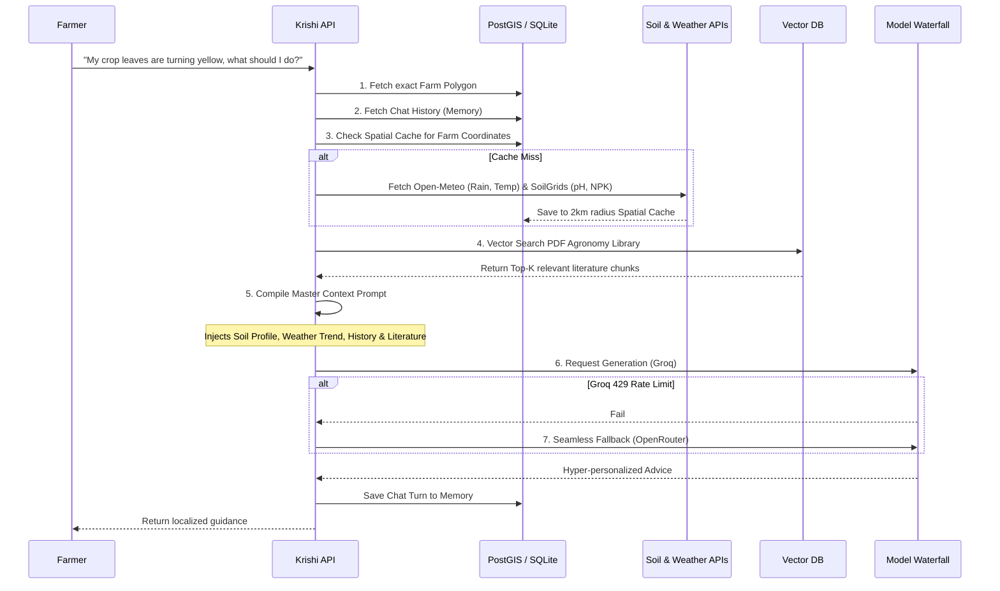

# Krishi AI - Precision Agriculture Backend

The central intelligence and data management engine for the Krishi AI Precision Agriculture platform. 

This repository contains the Django backend responsible for modeling geographic land parcels, caching geospatial environmental data, and powering a highly context-aware Retrieval-Augmented Generation (RAG) advisory chatbot designed specifically for Indian agriculture.

---

## 🏗️ System Architecture

Krishi AI acts as a smart orchestrator. It intercepts farmer queries, deeply enriches them with real-world spatial data, and guarantees a response using a fault-tolerant model waterfall.

```mermaid
graph TD
    Client[Farmer UI] --> API[Django REST Framework]
    
    subgraph Krishi Backend Engine
        API --> Lands[Lands Module\n(Spatial Boundaries)]
        API --> Data[Data Module\n(Environmental Caching)]
        API --> RAG[RAG Engine V2\n(LLM Orchestrator)]
    end
    
    Lands --> RelationalDB[(Relational DB\nPostGIS / SQLite)]
    Data --> RelationalDB
    
    Data -- "Cache Miss (Weather)" --> OpenMeteo[Open-Meteo API]
    Data -- "Cache Miss (Soil)" --> SoilGrids[ISRIC SoilGrids]
    
    RAG --> Chroma[(ChromaDB\nVector Store)]
    RAG --> RelationalDB
    RAG -- "Primary LLM Call" --> Groq[Groq API\nqwen/llama]
    Groq -- "429 Rate Limit Fallback" --> OpenRouter[OpenRouter API\ngpt-oss]
```

---

## 🧠 The RAG V2 Pipeline Flow

When a farmer asks a question about their crop, the system executes a complex spatial data pipeline before the LLM ever sees the prompt.



---

## 🧩 Core Modules Explained

### 1. `lands` - Spatial Farm Modeling
Manages the geographic representation of farmer fields.
* Uses **GeoDjango** to store farm locations as `PointField` and boundaries as `PolygonField`.
* Tracks area (hectares) and spatial relationships for mapping interfaces.

### 2. `data` - Geospatial Environmental Cache
A critical optimization layer to prevent redundant external API calls and handle external rate limits.
* **WeatherCache:** Stores precipitation, radiation, and temperature metrics from Open-Meteo tied to a spatial coordinate.
* **SoilCache:** Stores deep soil profiles (pH, Organic Carbon, Bulk Density, Texture, NPK) fetched from ISRIC SoilGrids.
* Reuses cached data for multiple farms within a 2km radius to drastically save bandwidth, latency, and compute.

### 3. `rag` - The Brain (RAG Engine V2)
The orchestration engine combining vector search with conversational AI.
* **Ingestion Pipeline:** Chunks and embeds massive PDF datasets (using HuggingFace embeddings) into a local **ChromaDB** vector store.
* **Model Waterfall:** Intelligently routes requests to bypass rate limits (like Groq's 429 errors). Cascades from fast, primary models to larger fallback networks automatically.
* **Memory Management:** Persists entire conversation trajectories (`ChatSession` & `ChatTurn`) into relational SQLite. It filters and injects rolling chronological context into the LLM without exploding token limits.

---

## ⚙️ Setup & Installation

### 1. Environment Configuration
Create a `.env` file in the `backend/` directory:
```env
# API Keys for LLM Generation
GROQ_API_KEY=your_groq_key_here
OPENROUTER_API_KEY=your_openrouter_key_here
```

### 2. Virtual Environment & Dependencies
```bash
python3 -m venv .venv_linux
source .venv_linux/bin/activate
pip install -r requirements.txt
```

### 3. Database Initialization & Run
```bash
cd backend/
python manage.py migrate
python manage.py runserver
```

The API will be available at `http://localhost:8000/`. You can monitor all spatial caches and chat histories via the Django Admin at `http://localhost:8000/admin`.
